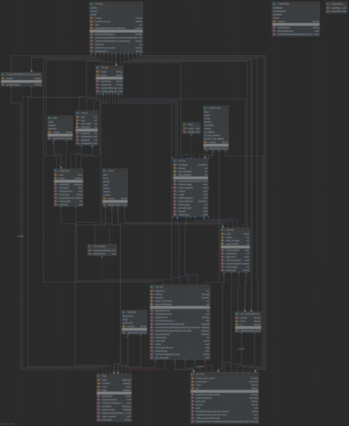

# Lab3proga
Laboratory work 3, ITMO, Programming.

#### Task

Описание предметной области, по которой должна быть построена объектная модель:

А потом забрались в свое потайное местечко. 
Когда они вышли оттуда при них был чемодан. 
Уж полночь прошла как вдруг весь сад озарился розовым светом.
Танцы приостановились: все решили, что это какой то новый вид фейерверка. 
Но это просто Тофсла и Вифсла открыли свой чемодан. 
Король рубинов, сверкая, лежал на лужайке прекрасный как никогда.
Все огни, фонари и даже сама луна померкли, потеряли свой блеск. 
В благоговейном молчании пылающий самоцвет обступала все более густая и многочисленная толпа.
А Снифф глубоко вздохнул и сказал: "Ну и счастливцы же эти Тофсла и Вифсла".
Король рубинов сверкал красным глазом на окутанной ночной тьмою Земле, и Волшебник на Луне заметил его.
Он уже совсем было отказался от дальнейших поисков. 
Усталый и печальный отдыхал он на краю кратера, а его черная пантера спала поодаль.
Он сразу понял что это сверкает красным там на Земле. 
Самый большой рубин на свете - Король рубинов, который он проискал не одну сотню лет.
Не спуская с Земли горящего взора он вскочил натянул перчатки и набросил на плечи плащ. 
Собранные в него драгоценные камни он попросту вытряхнул ведь его интересовал один единственный самоцвет и он рассчитывал меньше чем через полчаса держать его в своих руках.
Пантера с хозяином на спине поднялась в воздух.
Быстрее света неслись они в мировом пространстве. 
Их путь с шипением пересекали метеоры и звездная пыль порошей оседала на его плаще.

**Программа должна удовлетворять следующим требованиям:** 
1. Доработанная модель должна соответствовать принципам SOLID.
2. Программа должна содержать как минимум два интерфейса и один абстрактный класс (номенклатура должна быть согласована с преподавателем).
3. В разработанных классах должны быть переопределены методы equals(), toString() и hashCode().
4. Программа должна содержать как минимум один перечисляемый тип (enum).
5. В программе должны быть реализованы 2 собственных класса исключений (checked и unchecked), а также обработка исключений этих классов.
6. В программу необходимо добавить использование локальных, анонимных и вложенных классов (static и non-static).

**Class diagram**

**Acquired skills:**
- SOLID and STUPID principles
- Object oriented programming in Java
- Exceptions in Java
